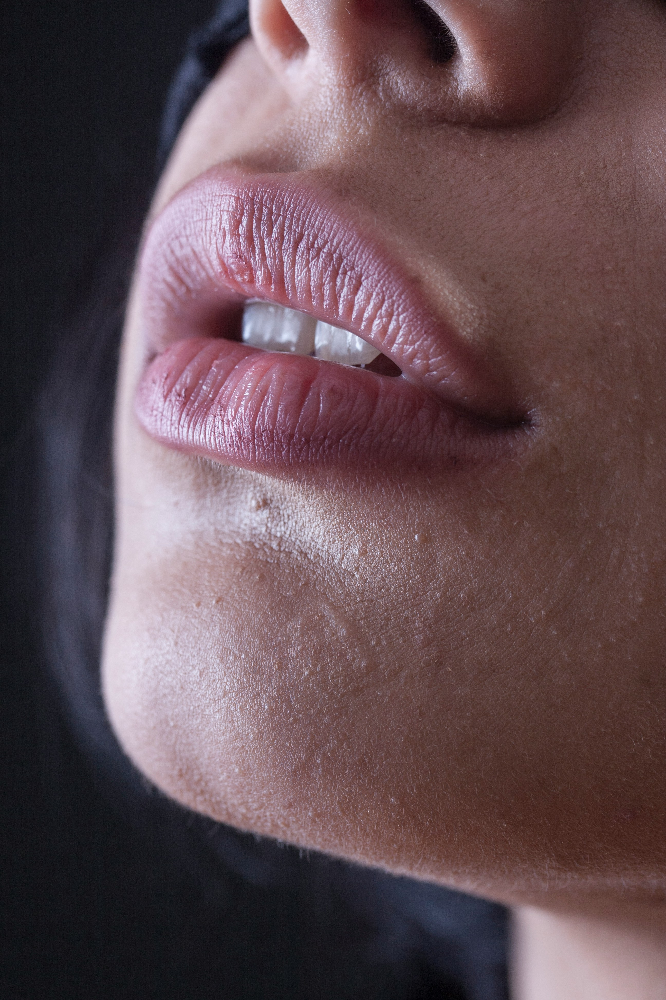
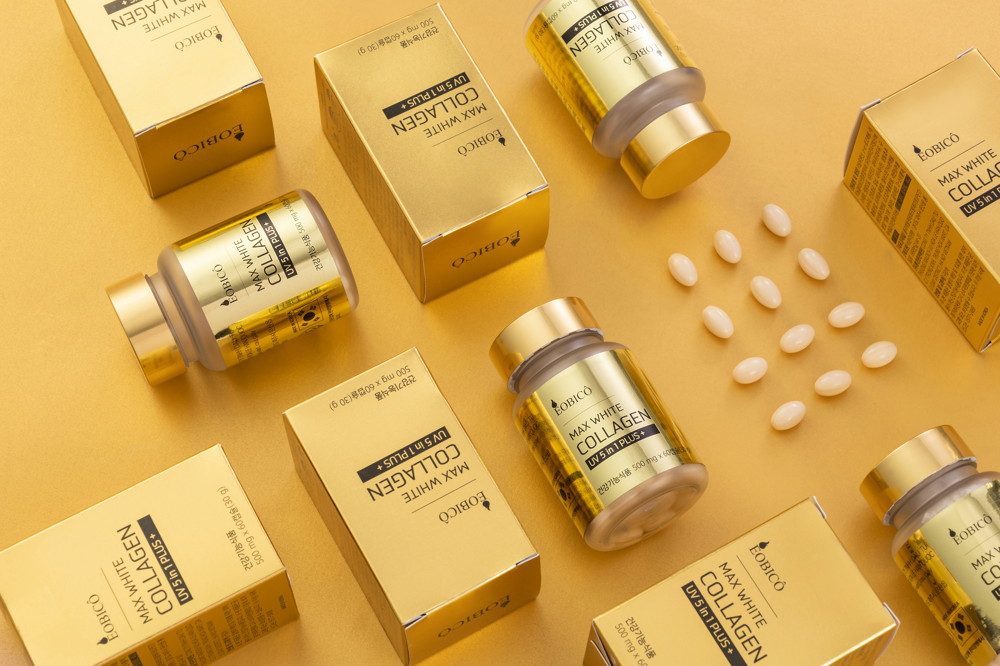

import imageAngelaFisher from '@/images/team/angela-fisher.jpg'

export const article = {
  date: '2025-02-01',
  title: 'A Complete Guide to Dermal Fillers: Types and Longevity',
  description:
    'Understanding the different types of dermal fillers available and how long each lasts can help you make informed decisions about your aesthetic treatments. This guide breaks down what you need to know.',
  author: {
    name: 'Angela Fisher',
    role: 'Aesthetic Nurse Specialist',
    image: { src: imageAngelaFisher },
  },
}

export const metadata = {
  title: article.title,
  description: article.description,
}

## 1. Hyaluronic Acid Fillers: Versatile and Reversible

Hyaluronic acid (HA) fillers remain the most popular category due to their versatility, predictable results, and reversibility. These fillers typically last between 6-18 months depending on the specific product and treatment area.

Brands like Juvederm and Restylane offer various formulations with different consistencies - from thinner products ideal for fine lines and lip enhancement (lasting 6-9 months) to thicker options for cheek augmentation and deep wrinkles (lasting 12-18 months). The metabolic rate of the treatment area, your personal metabolism, and injection technique all influence longevity.

One significant advantage: HA fillers can be dissolved with hyaluronidase if results aren't satisfactory.

## 2. Calcium Hydroxylapatite: Medium-Term Results

Calcium hydroxylapatite fillers (like Radiesse) offer a longer-lasting alternative to HA products, typically maintaining results for 12-24 months. These fillers consist of calcium microspheres suspended in a gel carrier, providing immediate volume while stimulating natural collagen production over time.

Best suited for deeper lines and facial contouring, particularly in areas like nasolabial folds and cheeks, these fillers provide structural support that improves as your own collagen develops. Unlike HA fillers, calcium hydroxylapatite products cannot be dissolved, so proper placement by an experienced provider is essential.

## 3. Poly-L-Lactic Acid: The Collagen Stimulator

For patients seeking gradual, long-lasting improvement, Poly-L-Lactic Acid fillers (Sculptra) offer unique benefits with results that can last up to 2-3 years. Rather than providing immediate volume, these fillers work as biostimulators, gradually triggering your body's natural collagen production.

Treatment typically involves a series of 2-3 sessions spaced several weeks apart, with results developing progressively over 3-6 months. This makes Sculptra ideal for addressing age-related volume loss across larger facial areas like temples, cheeks, and jawline. While requiring patience, the gradual nature of results creates a subtle, natural-looking rejuvenation that many patients prefer.

