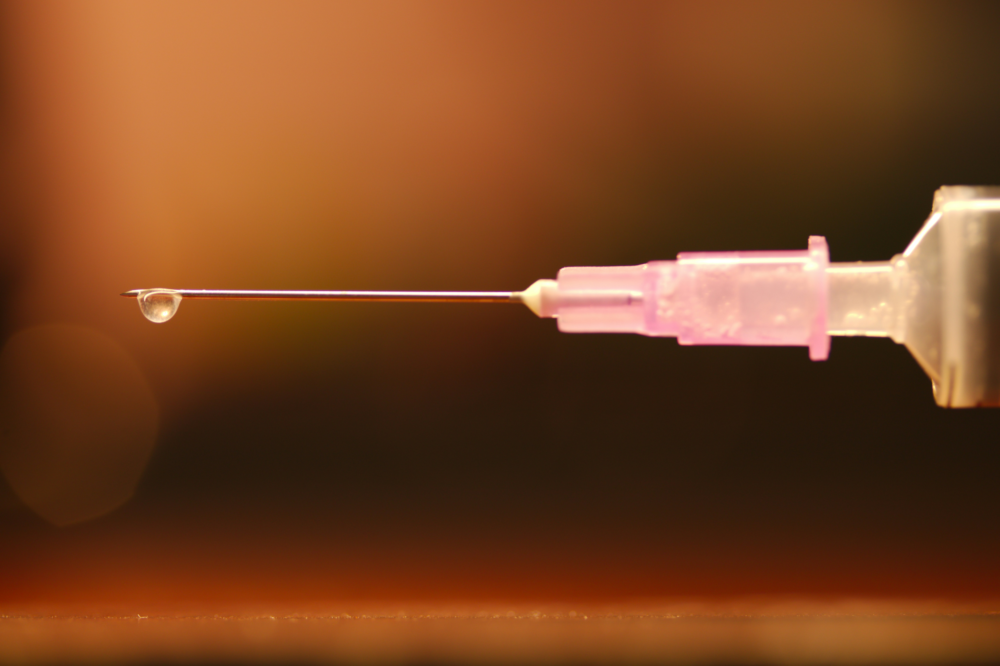

import imageChelseaHagon from '@/images/team/chelsea-hagon.jpg'

export const article = {
  date: '2025-04-06',
  title: 'Debunking Common Neuromodulator Myths: What You Need to Know in 2025',
  description:
    "Let's explore the most persistent misconceptions about neuromodulator treatments and provide evidence-based facts that can help you make informed decisions about aesthetic procedures.",
  author: {
    name: 'Chelsea Hagon',
    role: 'Aesthetic Specialist',
    image: { src: imageChelseaHagon },
  },
}

export const metadata = {
  title: article.title,
  description: article.description,
  alternates: {
    canonical: 'https://www.prismaclinicmarbella.es/en/blog/botox-myths',
    languages: {
      en: 'https://www.prismaclinicmarbella.es/en/blog/botox-myths',
      es: 'https://www.prismaclinicmarbella.es/es/blog/botox-myths',
      se: 'https://www.prismaclinicmarbella.es/se/blog/botox-myths',
    },
  },
}

## 1. Myth: Neuromodulators Make Your Face Look Frozen and Unnatural

One of the most persistent myths about neuromodulators is that they inevitably lead to a "frozen" appearance where you can't express emotions. The reality is that modern neuromodulator techniques focus on strategic muscle relaxation rather than complete immobilization. When administered by a skilled practitioner, neuromodulators should preserve natural facial expressions while reducing unwanted wrinkles.

In 2025, advanced injection techniques and personalized treatment plans have made "overdone" results increasingly rare. Today's approach emphasizes natural-looking results that enhance rather than alter your appearance.

Studies consistently show that patients receiving appropriate neuromodulator dosages maintain over 80% of their normal facial expressivity, with only the specific muscles causing problematic lines being targeted.

## 2. Myth: Neuromodulators and Dermal Fillers Are the Same Thing

Perhaps the most common confusion we encounter is patients using "neuromodulator" as a catch-all term for all injectable treatments. Neuromodulators and dermal fillers work in fundamentally different ways and address different cosmetic concerns.

Neuromodulators temporarily relax muscles to reduce dynamic wrinkles (those formed by movement), while fillers add volume to static wrinkles and areas of lost facial volume. Understanding this distinction is crucial for setting realistic expectations about treatment outcomes.

In 2025, combination therapies utilizing both neuromodulators and specific fillers in complementary ways have become the gold standard for comprehensive facial rejuvenation. These tailored approaches address multiple signs of aging simultaneously, providing more natural and balanced results than either treatment alone.

## 3. Myth: Neuromodulators Are Dangerous Because They're a "Toxin"

While neuromodulators are indeed derived from the same bacterium that causes botulism, the purified form used in neuromodulator injections contains such minute amounts that it cannot spread throughout the body when properly administered.

With over 7.4 million procedures performed annually in the US alone, neuromodulators have one of the best safety profiles of any cosmetic procedure when administered by qualified medical professionals in appropriate settings.

In 2025, we've seen further refinements in neuromodulator formulations and injection protocols that have reduced side effects like bruising and discomfort. Modern techniques including microdroplet injections and precision mapping have minimized complications while improving results. Research continues to demonstrate the safety profile of neuromodulators, with serious adverse events occurring in less than 0.01% of treatments.
